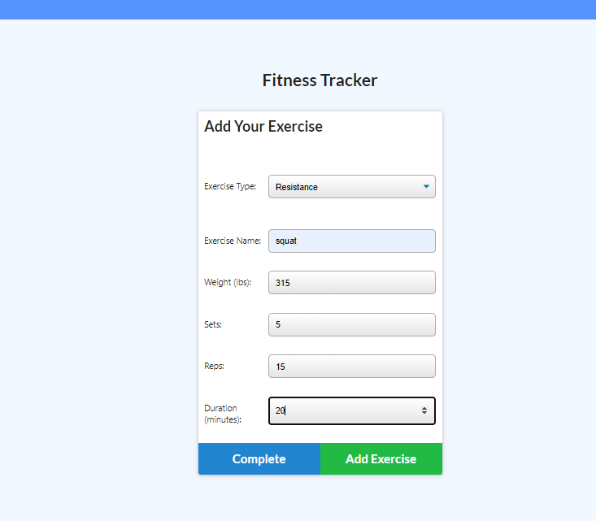
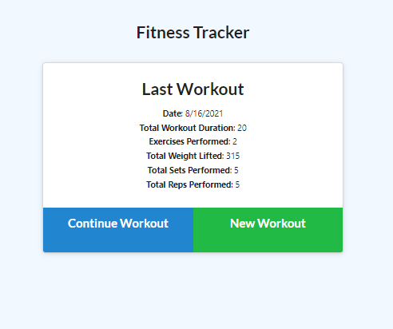

# Workout-Tracker

## Description:
The purpose of this exercise was to add functionality to starter code in order utilizing a noSQL database, in this case mongoDB and mongoose to take in user input, aggregate it and display certain aspects of it back to the user. In this context it was a workout a tracker where a user could add exercises to a workout plan and view these workouts to show the last workout on the landing page, and the last 7 workouts on the dashboard page, visualizing it using a line graph with exercise duration and bar graph showing pounds lifted.

## Technologies Utilized:
- Javascript
- Node 
- NPM package
- Express server
- Express router
- Mongoose
- Heroku

## Installation & Use:

### To install necessary packages:
- While in the directory, type in command line: npm i

### To start the server & seed DB:
- While in the directory, type in command line: npm run seed
- While in the directory, type in command line: npm start

## Screenshots:
### Landing Screen Workout Summary With Seeded Data

### Add Exercise -> Complete Workout

### Landing Screen Showing Lastest Workout, User Added

### Charts Showing Summaries of Last 7 Workouts, Including the Latest User Added Workout Shown Above

## Challenges & Thoughts:
- This was a challenging exercise to make work, it is not working correctly as deployed on heroku and I am unsure as to why... it works locally. 
- In the model it had an issue with the type key inside the exercises object. I also had an incorrect datatype with "duration" that was breaking both aggregates
- I found many of the a tags did not work in the html starter code and modified it, unsure if I needed to use 'path' here, perhaps that is what is breaking it in heroku
- The aggregate method was a bit tricky (sorted first, limited to 7 and reverse sorted the output) in terms properly orienting and plucking the newest 7 objects and not the oldest 7 objects. That reverse sort was because my charts were displaying backwards.
- It seems the 'complete' button is creating a new object if the form fields are empty, this was screwing up my aggregates... at first, however a fix to a datatype error in the model mentioned above, fixed the aggregator, even though the empty object was still created, as you can see in the screen shots above. I added one exercise and it generated an empty object with 0 in fields, unsure if a validator in the object would fix this.

## Questions/Links:
https://github.com/MarkAndersen
https://pacific-dawn-55437.herokuapp.com/
[Email me](mailto:Mark.Andersen75@gmail.com)
